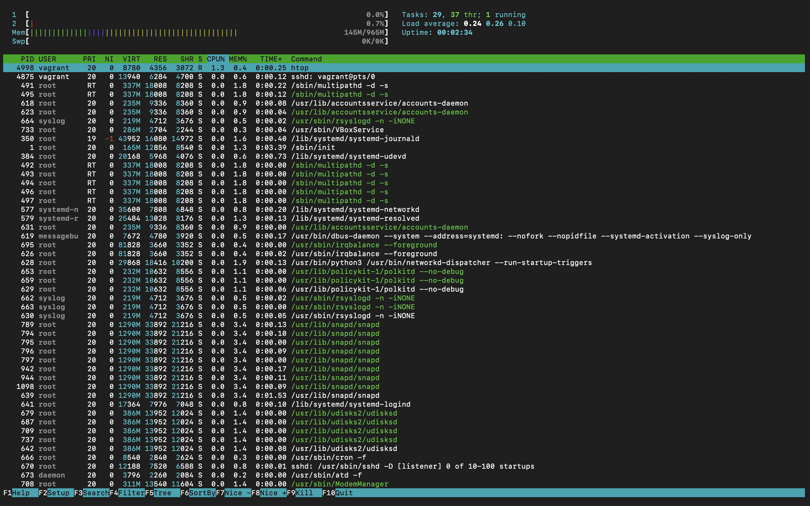
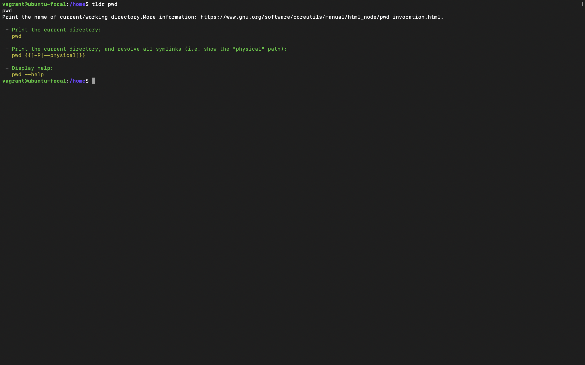
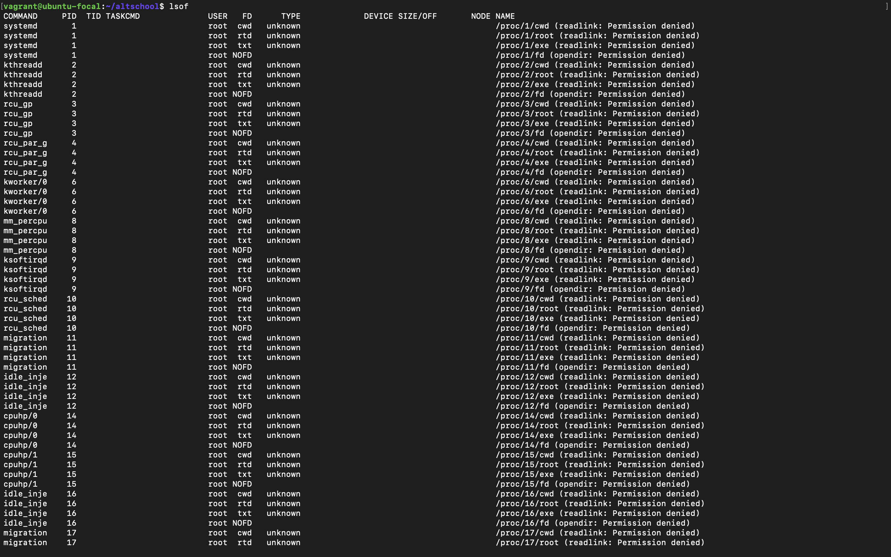

# Linux Commands Research

This document contains 10 useful Linux commands that were not mentioned in the module.

## **Table of Contents**

1. [htop - Interactive Process Manager](#1-htop---interactive-process-manager)
2. [tac Command - Reverse File Content](#2-tac-command---reverse-file-content)
3. [ `tldr` - Simplified Man Pages](#3-tldr---simplified-man-pages)
4. [`alias` - Create Shortcuts for Commands](#4-alias---create-shortcuts-for-commands)
5. [`grep` - Search for Patterns in Files](#5-grep---search-for-patterns-in-files)
6. [`time` - Measure Command Execution Time](#6-time---measure-command-execution-time)
7. [`lsof` - List Open Files](#7-lsof---list-open-files)

## 1. `htop` - Interactive Process Manager

The `htop` command is an improved version of `top`. It provides an interactive interface to monitor system processes.

**Usage:**

```bash
htop
```

**Screenshot:**


## 2. `tac` Command - Reverse File Content

The `tac` command displays the contents of a file in **reverse order**, line by line.

**Syntax:**

```bash
tac filename
```

**Screenshot:**


## 3. `tldr` - Simplified Man Pages

The `tldr` command provides simplified and community-contributed examples of how to use Linux commands. It offers concise and easy-to-understand command syntax for quick reference.

**Syntax:**

```bash
tldr command
```

**Installation:**

If `tldr` is not already installed, you can install it using:

```bash
sudo apt install tldr
```

**Screenshot:**


## 4. `alias` - Create Shortcuts for Commands

The `alias` command allows you to create shortcuts for long or complex commands, saving time and making your workflow more efficient.

**Syntax:**

```bash
alias shortcut="command"
```

**Screenshot:**


## 5. `grep` - Search for Patterns in Files

The `grep` command is used to search for a specified pattern within files. It is one of the most useful and powerful tools for searching through text files.

**Syntax:**

```bash
grep [options] pattern [file...]
```

**Screenshot:**


## 6. `time` - Measure Command Execution Time

The `time` command measures how long a command takes to execute, which is useful for performance monitoring and debugging.

**Syntax:**

```bash
time command
```

**Screenshot:**


## 7. `lsof` - List Open Files

The `lsof` command (List Open Files) shows which files are open by which processes. This command is useful for troubleshooting, system monitoring, and managing system resources.

**Syntax:**

```bash
lsof [options] [file|directory]
```

**Screenshot:**


### 8. `zip` - Compresses Files into a ZIP Archive

The `zip` command is used to compress files or directories into a ZIP archive format. This is useful for saving space or bundling multiple files into one for easier storage or transfer.

#### Syntax:

```bash
zip [options] archive_name.zip file1 file2 ...
```

**Screenshot:**

